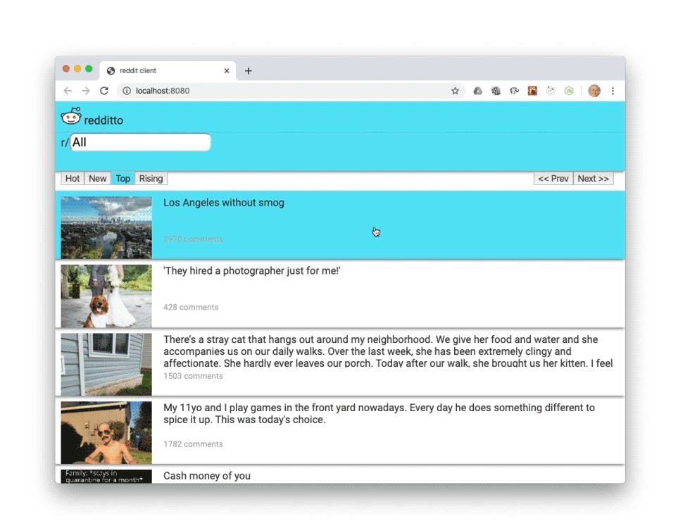

# react-reddit-client
React Reddit client with Hooks and Router.



## Running Locally

Make sure you have [Node.js](http://nodejs.org/) installed.

```sh
git clone https://github.com/patrick-s-young/react-reddit-client.git # or clone your own fork
cd src
npm install
npm start
```

## Built With

* [React](https://react-cn.github.io/react/downloads.html) - JavaScript UI library.
* [React Router](https://reacttraining.com/react-router/web/guides/quick-start) - Declarative Routing for React.js
* [webpack](https://webpack.js.org/) - Static module builder.

## Authors

* **Patrick Young** - [Patrick Young](https://github.com/patrick-s-young)

## License

This project is licensed under the MIT License - see the [LICENSE](LICENSE) file for details.
